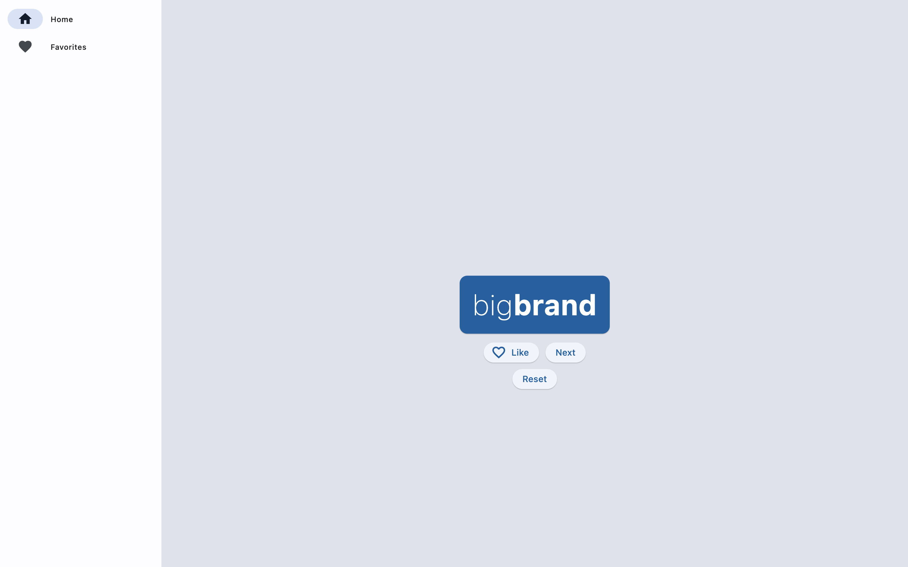
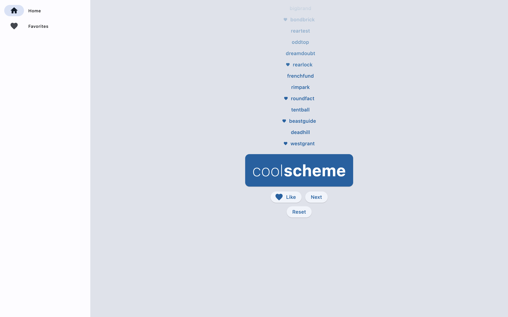
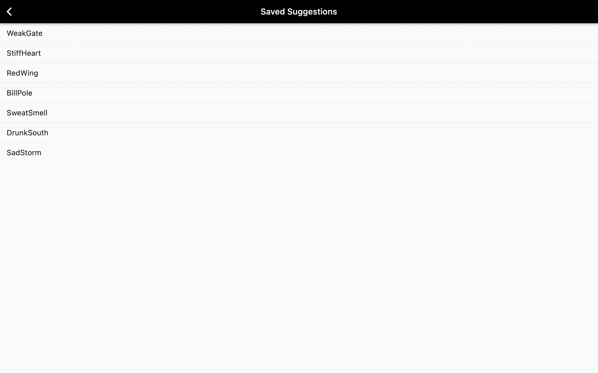
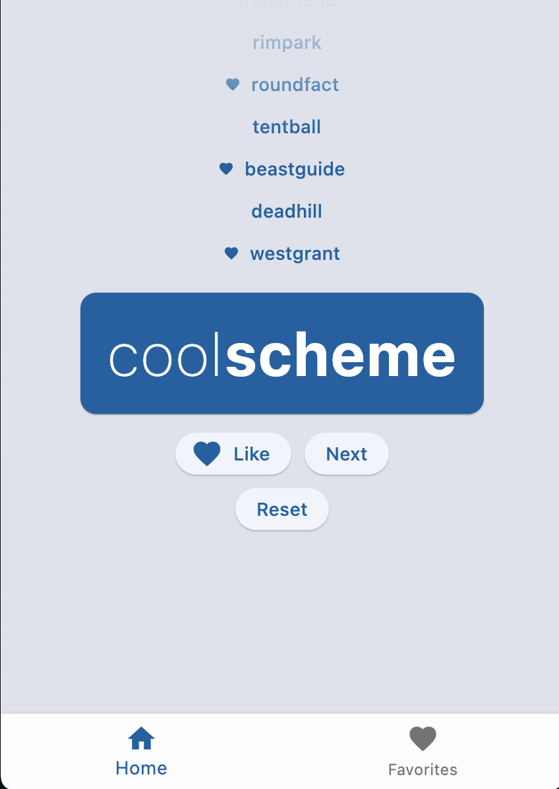

# infinity

Flutter tutorial for creating desktop apps.

## Getting Started

Infinity words app is a tutorial from flutter cookbook.

A few resources to get you started if this is your first Flutter project:

- [Lab: Write your first Flutter app](https://docs.flutter.dev/get-started/codelab)
- [Cookbook: Useful Flutter samples](https://docs.flutter.dev/cookbook)

------

## Screenshots

- ```text
  Main Screen
  ```
  
  

- ```
  Saved Words
  ```
  

- ```
  Responsiveness
  ```
  


------
## My personal touch

As an improvement, I've added a reset button, which clears word history and favorite words.


